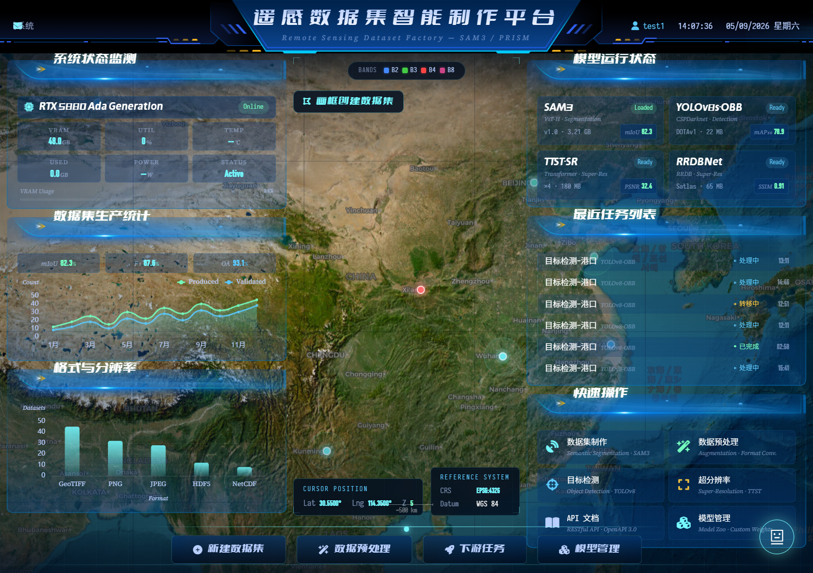
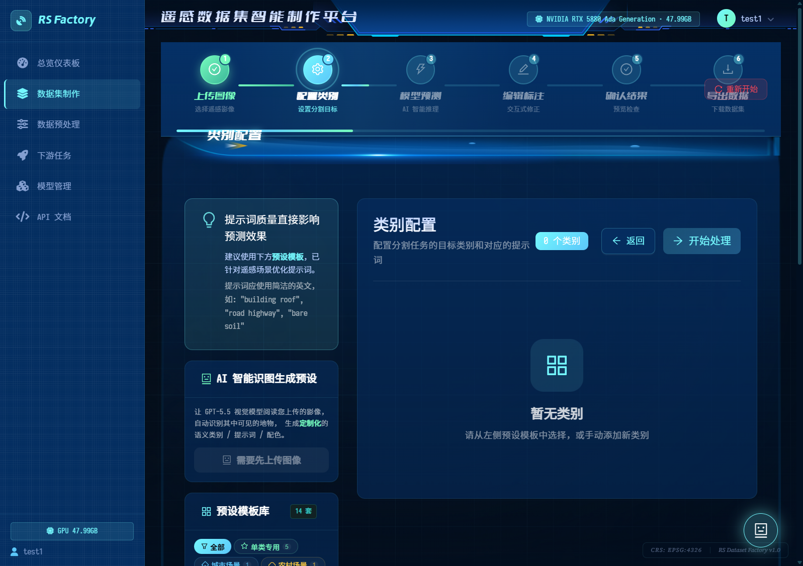
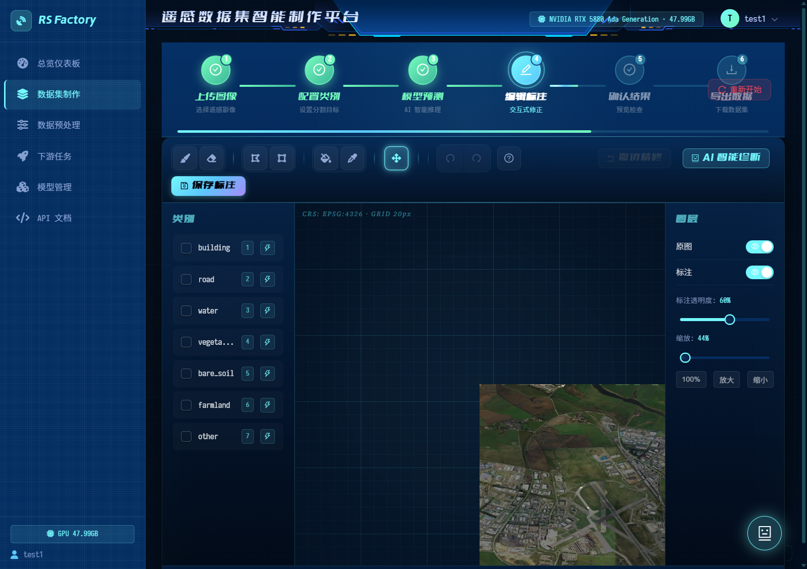
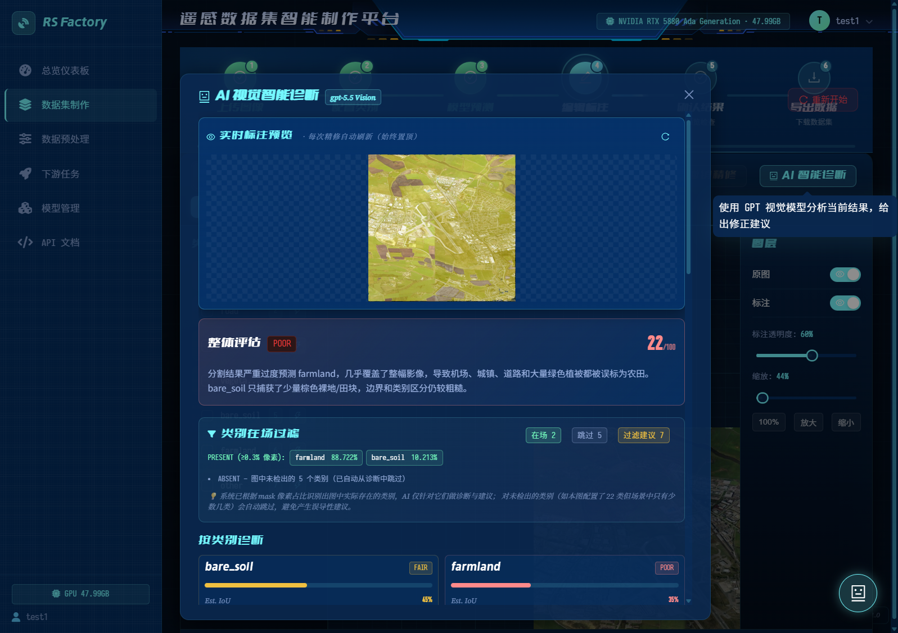
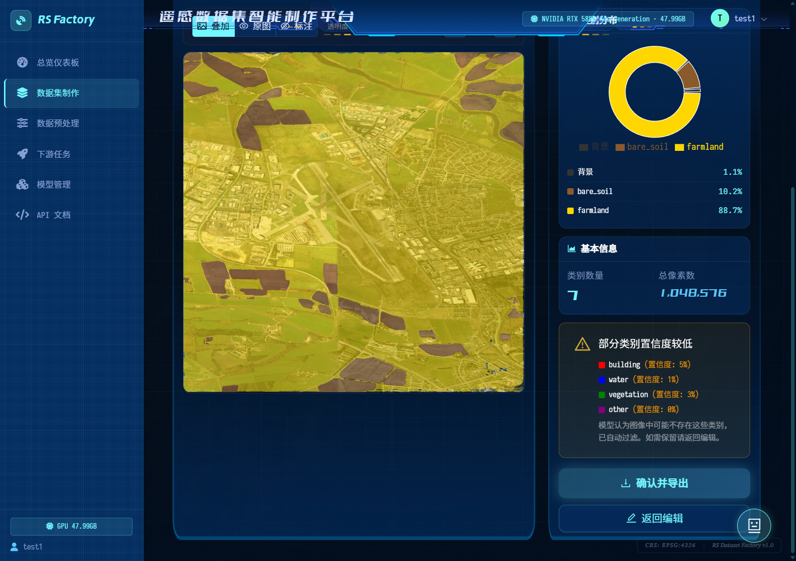
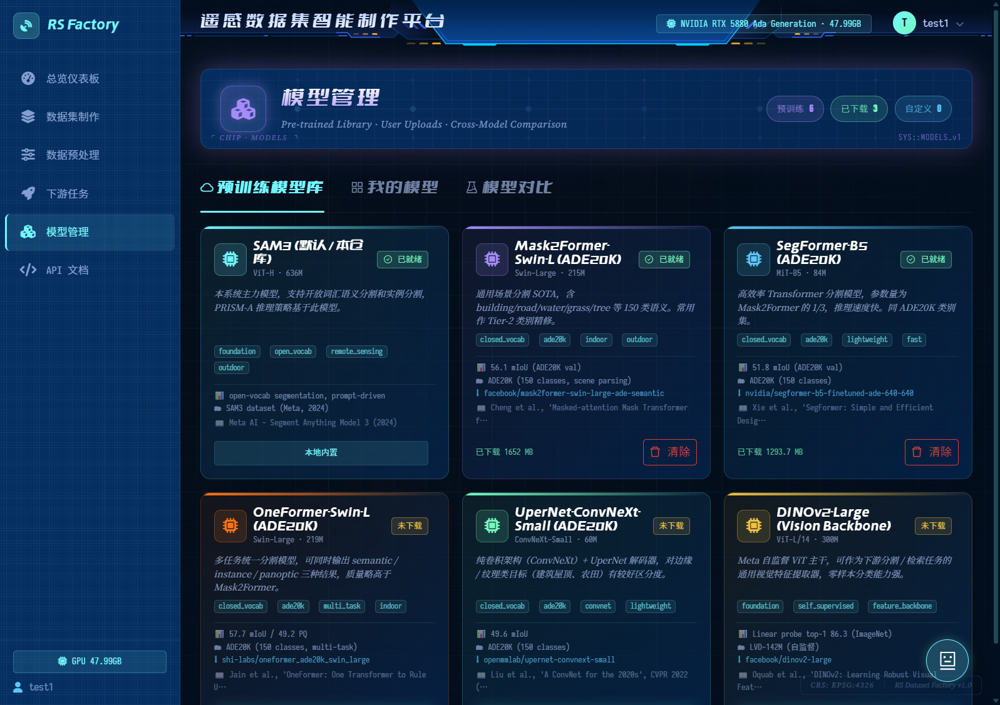

# Remote Sensing Dataset Factory

> **遥感数据集智能制作系统** — 基于 SAM 3 / PRISM 等开放词汇分割模型，把 GeoTIFF 影像一键转成可训练的语义分割数据集，附带预训练模型管理、AI 诊断、超分辨率增强、批量任务调度等完整工具链。

[](LICENSE)   

> ⚠️ 本仓库**不包含任何模型权重**。请按 [`docs/MODEL_DOWNLOADS.md`](docs/MODEL_DOWNLOADS.md) 自行下载（最低只需 SAM 3 主权重一个文件）。所有第三方模型 / 论文引用请见 [`THIRD_PARTY_NOTICES.md`](THIRD_PARTY_NOTICES.md)。

---

## 截图

|  | |
|---|---|
|  **总览仪表盘** |  **类别预设 / 自定义** |
|  **分割结果可视化** |  **AI 数据集诊断** |
|  **类别分布统计** |  **预训练模型管理** |

---

## 功能特点

- 🛰️ **大尺寸 GeoTIFF 上传**：单文件最高 10 GB，自动读取波段 / 投影 / 元数据
- 🧠 **开放词汇语义分割**：SAM 3 + PRISM-A 推理策略，可对任意自定义类别 prompt
- 🎨 **类别预设 + 自定义**：内置 14 套预设（江西农村 / 沿海城市 / WHU / DeepGlobe / LoveDA / iSAID / ISPRS Potsdam / OpenEarthMap …）
- 📦 **标准化数据集生成**：自动 train / val / test 切分，完整目录结构
- 🤖 **AI 数据集诊断**：调用任意 OpenAI 兼容 LLM 对生成结果做质量评估与建议
- 🔍 **超分辨率增强**：集成 Real-ESRGAN / Satlas-SR / TTST 等多种上采样模型
- 📊 **多种可视化**：全景对比 / 类别分布 / 区域放大 / 类别 IoU
- ⚡ **实时进度推送**：WebSocket 同步处理进度与日志
- 🧰 **预训练模型管理**：HF Hub 一键下载 / 删除 Mask2Former / SegFormer / OneFormer / UperNet / DINOv2

---

## 快速开始

### 0. 系统要求

- Windows 10 / 11 或 Linux
- Python 3.10+（建议 conda）
- Node.js 18+
- NVIDIA GPU (CUDA 11.8+，至少 12 GB 显存以加载 SAM 3)

### 1. 克隆并安装依赖

```bash
git clone https://github.com/anticipate218/remote-sensing-dataset-factory.git
cd remote-sensing-dataset-factory

# Python 依赖（建议先 conda activate 你自己的 PyTorch 环境）
pip install -r requirements.txt

# 前端依赖
cd frontend && npm install && cd ..
```

### 2. 下载模型权重 ⬇️

> 这一步**最重要**——本仓库不分发权重。

最少只需要一个文件 `weights/sam3.pt`（约 3.4 GB），其他权重按需下载。完整指南：

📖 **[docs/MODEL_DOWNLOADS.md](docs/MODEL_DOWNLOADS.md)**

### 3. 配置环境变量

```bash
cp .env.example .env
# 然后编辑 .env，至少填写：
#   JWT_SECRET=<用 python -c "import secrets;print(secrets.token_hex(32))" 生成>
#   OPENAI_API_KEY=<可选，仅在使用 AI 助手 / GPT 精修时需要>
```

### 4. 启动

**Windows 一键启动：**

```cmd
start_all.bat
```

**手动启动：**

```bash
# 后端 (FastAPI on :8000)
python -m uvicorn backend.main:app --host 127.0.0.1 --port 8000 --reload

# 前端 (Vite on :3000)
cd frontend && npm run dev
```

访问：

- 前端 UI：http://localhost:3000
- API 文档：http://localhost:8000/docs

---

## 项目结构

```
remote-sensing-dataset-factory/
├── backend/                    # FastAPI 后端
│   ├── api/                    # 路由 + WebSocket + Pydantic schema
│   ├── core/                   # GeoTIFF 切分 / 预测器
│   ├── services/               # 业务服务 (dataset / refine / AI 校正 ...)
│   ├── tasks/                  # 异步任务
│   ├── utils/                  # 工具函数
│   ├── auth.py                 # JWT 用户系统
│   ├── config.py               # 主配置 + 类别预设
│   └── main.py                 # ASGI 入口
├── frontend/                   # React 18 + TS + Ant Design
│   ├── src/
│   │   ├── components/         # 30+ UI 组件（Dashboard / Annotation / Models / ...）
│   │   ├── services/           # API 调用层
│   │   ├── stores/             # Zustand 状态
│   │   └── styles/             # 主题 / 全局样式
│   └── package.json
├── sam3/                       # ⚠️ Meta SAM 3 官方源码（直接 vendor 进来，保留版权头）
├── weights/                    # ⬇️ 你需要自己下载权重到这里（gitignored）
├── docs/
│   ├── MODEL_DOWNLOADS.md      # 完整模型下载指南
│   └── screenshots/            # README 用截图
├── uploads/                    # 用户上传 (gitignored)
├── outputs/                    # 生成数据集 (gitignored)
├── logs/                       # 运行日志 (gitignored)
├── .env.example                # 环境变量模板
├── .gitignore
├── docker-compose.yml
├── Dockerfile.backend
├── LICENSE                     # MIT（仅本项目自有代码）
├── PRODUCT_PLAN.md             # 产品规划文档
├── README.md
├── THIRD_PARTY_NOTICES.md      # 完整第三方致谢与引用
├── requirements.txt
├── start_all.bat               # Windows 一键启动
├── start_backend.bat
└── start_frontend.bat
```

---

## 使用流程

1. **注册 / 登录**：默认在 `users.db`（SQLite）中维护账号，启动时自动创建
2. **上传影像**：拖拽 GeoTIFF / RGB 影像，自动读取元数据
3. **配置类别**：选预设或自定义类别 + 文本 prompt + 调色板
4. **调参**：裁剪窗口、stride、置信度阈值、train/val/test 划分比例
5. **开始处理**：实时看到 WebSocket 推送的切片 / 推理 / 拼接进度
6. **AI 诊断（可选）**：由 LLM 自动评估类别分布、漏标、过分割等问题并给出修复建议
7. **下载**：一键打包 ZIP（标准 `images/ + masks/ + labels.json` 结构）

---

## 技术栈

| 层级 | 选型 |
|------|------|
| 后端 | FastAPI · Uvicorn · Pydantic v2 · PyTorch · Rasterio · HuggingFace Hub · PyJWT |
| 推理 | SAM 3 (Meta) · Mask2Former · SegFormer · OneFormer · UperNet · DINOv2 · YOLOv8 · Real-ESRGAN |
| 前端 | React 18 · TypeScript · Vite · Ant Design 5 · Zustand · TanStack Query · Recharts · Framer Motion · Three.js · Leaflet |
| 数据 | GeoTIFF · COCO-style mask · 标准 ImageNet split |

---

## 致谢与引用

本项目站在巨人的肩膀上，使用了下列开源模型 / 数据集 / 论文。**完整的版权、引用与 BibTeX 见 [`THIRD_PARTY_NOTICES.md`](THIRD_PARTY_NOTICES.md)。**

### 核心模型
- **[Segment Anything Model 3](https://github.com/facebookresearch/sam3)** — Meta AI（Apache-2.0）— `sam3/` 目录
- **[Mask2Former](https://github.com/facebookresearch/Mask2Former)** — Cheng et al., CVPR 2022（MIT）
- **[SegFormer](https://github.com/NVlabs/SegFormer)** — Xie et al., NeurIPS 2021（NVIDIA Source Code License）
- **[OneFormer](https://github.com/SHI-Labs/OneFormer)** — Jain et al., CVPR 2023（MIT）
- **[ConvNeXt + UperNet](https://github.com/facebookresearch/ConvNeXt)** — Liu et al., CVPR 2022 / Xiao et al., ECCV 2018
- **[DINOv2](https://github.com/facebookresearch/dinov2)** — Oquab et al., 2023（Apache-2.0）
- **[SegEarth-OV](https://github.com/likyoo/SegEarth-OV)** — 遥感开放词汇分割推理策略参考

### 检测与超分
- **[YOLOv8 / Ultralytics](https://github.com/ultralytics/ultralytics)** — Glenn Jocher et al.（**AGPL-3.0**）
- **[Real-ESRGAN](https://github.com/xinntao/Real-ESRGAN)** — Wang et al., ICCVW 2021（BSD-3）
- **[Satlas Super-Resolution](https://github.com/allenai/satlas-super-resolution)** — Allen Institute for AI（MIT）
- **[TTST](https://github.com/XY-boy/TTST)** — Xiao et al., 2024

### 数据集预设来源
WHU Building · DeepGlobe · Sen1Floods11 · LoveDA · iSAID / DOTA · ISPRS Potsdam / Vaihingen · OpenEarthMap

> 当你使用对应预设处理数据并发表论文 / 商用时，**请按 `THIRD_PARTY_NOTICES.md` 中的 BibTeX 引用原始作者**。

---

## License

- **本仓库自有代码**：MIT License — 见 [`LICENSE`](LICENSE)
- **`sam3/` 目录（Meta SAM 3 vendored 源码）**：Apache License 2.0
- **下载到 `weights/` 的各模型权重**：分别遵循各自原作者协议（详见 `THIRD_PARTY_NOTICES.md`）

商用前请特别注意 **YOLOv8 (AGPL-3.0)** 与 **SegFormer (NVIDIA Source Code License-NC)** 的限制。

---

## Contributing

欢迎 Issue / PR：

- 新的预设类别模板（注明数据集来源 + 论文）
- 新的精修 / 超分模型集成
- Bug 修复 / 文档改进

提 PR 前请确保：
1. 不引入新的硬编码密钥 / 个人路径
2. 不提交模型权重 / 数据集二进制
3. 使用了正确的第三方 attribution

---

## Author

[@anticipate218](https://github.com/anticipate218)
